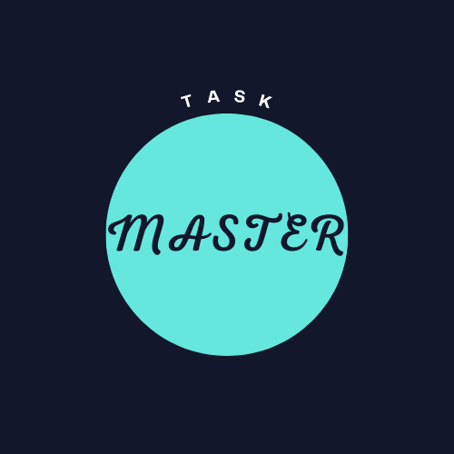

<a name="readme-top"></a>

<!-- PROJECT SHIELDS -->
<!--
*** I'm using markdown "reference style" links for readability.
*** Reference links are enclosed in brackets [ ] instead of parentheses ( ).
*** See the bottom of this document for the declaration of the reference variables
*** for contributors-url, forks-url, etc. This is an optional, concise syntax you may use.
*** https://www.markdownguide.org/basic-syntax/#reference-style-links
-->
[![Contributors][contributors-shield]][contributors-url]
[![Forks][forks-shield]][forks-url]
[![Stargazers][stars-shield]][stars-url]
[![Issues][issues-shield]][issues-url]
[![MIT License][license-shield]][license-url]
[![LinkedIn][linkedin-shield]][linkedin-url]


<!-- PROJECT LOGO -->
<br />
<div align="center">
  <a href="https://github.com/Byron-web/task-manager">
    
  </a>

  <h3 align="center">Task Master</h3>

  <p align="center">
    An awesome ToDo app to keep your time management in check!
    <br />
    <a href="https://github.com/Byron-web/task-manager"><strong>Explore the docs »</strong></a>
    <br />
    <br />
    <a href="https://github.com/Byron-web/task-manager">View Demo</a>
    ·
    <a href="https://github.com/Byron-web/task-manager/issues">Report Bug</a>
    ·
    <a href="https://github.com/Byron-web/task-manager/issues">Request Feature</a>
  </p>
</div>


<!-- TABLE OF CONTENTS -->
<details>
  <summary>Table of Contents</summary>
  <ol>
    <li>
      <a href="#about-the-project">About The Project</a>
      <ul>
        <li><a href="#built-with">Built With</a></li>
      </ul>
    </li>
    <li>
      <a href="#getting-started">Getting Started</a>
      <ul>
        <li><a href="#prerequisites">Prerequisites</a></li>
        <li><a href="#installation">Installation</a></li>
      </ul>
    </li>
    <li><a href="#usage">Usage</a></li>
    <li><a href="#roadmap">Roadmap</a></li>
    <li><a href="#contributing">Contributing</a></li>
    <li><a href="#license">License</a></li>
    <li><a href="#contact">Contact</a></li>
    <li><a href="#acknowledgments">Acknowledgments</a></li>
  </ol>
</details>


<!-- ABOUT THE PROJECT -->
## About The Project

[![Product Name Screen Shot][product-screenshot]](https://example.com) <!--Add netlify to this project -->

I really liked the idea of being able to solve my own real world problems with code. So I decided to start building applications that did exactly that. There are many "ToDo" apps out there but this one is configured to my specific needs and as it evolves so will my preferences. What makes this ToDo app stand out from the rest is continued support that I am going to provide for it for many years to come. Please consider trying my ToDo app out.

Here's why:
* Productivity applications should always be focused on solving real world problems at real world speeds.
* You shouldn't have to remember all of your tasks or try and manage them internally in your head.
* Your work life should be managed FOR you, so your personal life can be managed BY you :smile:

Of course, no one task manager will serve all of your daily/weekly/monthly/yearly task management requirements since your needs may be different. So I'll be updating this application in the near future. You may also suggest changes by forking this repo and creating a pull request or opening an issue. Thanks in advance to all the people who have/will contribute/d to expanding this application!

Clone this repo to get started.

<p align="right">(<a href="#readme-top">back to top</a>)</p>


### Built With


* [![Angular][Angular.io]][Angular-url]
* [![TypeScript][TS]][TS-url]
* [![TailwindCss][Tailwind]][Tailwind-url]

<p align="right">(<a href="#readme-top">back to top</a>)</p>


<!-- GETTING STARTED -->
## Getting Started


### Prerequisites

Install the latest Node Package Manager in your CLI like shown below.
* npm
  ```sh
  npm install npm@latest -g
  ```

### Installation

1. Clone the repo
   ```sh
   git clone https://github.com/your_username_/Project-Name.git
   ```
2. Install NPM packages
   ```sh
   npm install
   ```

<p align="right">(<a href="#readme-top">back to top</a>)</p>


<!-- USAGE EXAMPLES -->
## Usage


 this is the initial state. Here you are presented with the list menu(on the left) where you can either select an already created task, or you can create a new task by  clicking "Add List". you may also minimize the list menu horizontally to the left by clicking on the arrow pointing left at the bottom right of the list menu.

&nbsp;


Once a List has been created you may add tasks to the selected list, as well as icons to represent that list. clickingthe checkbox to the left of the task will complete the task. A timestamp will show on the far left of the task to show when the task was completed.

<!-- _For more examples, please refer to the [Documentation](https://example.com)_ -->

<p align="right">(<a href="#readme-top">back to top</a>)</p>


<!-- ROADMAP -->
## Roadmap

- [x] Create task menu
- [x] Create task list
- [ ] Add nav bar 
  - [ ] Add Search Funtionality
  - [ ] Add account login 
- [ ] Add Skeleton 
  - [ ] Task menu 
  - [ ] Task list
- [ ] Update the task card UI
    - [ ] Add shadow and border
    - [ ] Scale up slightly on hover
- [ ] Make App responsive
- [ ] Add calendar
- [ ] More to come

See the [open issues](https://github.com/Byron-web/task-manager/issues) for a full list of proposed features (and known issues).

<p align="right">(<a href="#readme-top">back to top</a>)</p>


<!-- CONTRIBUTING -->
## Contributing

Contributions are what make the open source community such an amazing place to learn, inspire, and create. Any contributions you make are **greatly appreciated**.

If you have a suggestion that would make this better, please fork the repo and create a pull request. You can also simply open an issue with the tag "enhancement".
Don't forget to give the project a star! Thanks again!

1. Fork the Project
2. Create your Feature Branch (`git checkout -b feature/AmazingFeature`)
3. Commit your Changes (`git commit -m 'Add some AmazingFeature'`)
4. Push to the Branch (`git push origin feature/AmazingFeature`)
5. Open a Pull Request

<p align="right">(<a href="#readme-top">back to top</a>)</p>


<!-- LICENSE -->
## License

Distributed under the MIT License. See `LICENSE.txt` for more information.

<p align="right">(<a href="#readme-top">back to top</a>)</p>


<!-- CONTACT -->
## Contact

Byron - [Byron Labuschagne](https://www.linkedin.com/in/byron-labuschagne/) - byron@byron-labuschagne.com

Project Link: [https://github.com/Byron-web/task-manager](https://github.com/Byron-web/task-manager)

<p align="right">(<a href="#readme-top">back to top</a>)</p>


<!-- ACKNOWLEDGMENTS -->
## Acknowledgments

* [Choose an Open Source License](https://choosealicense.com)
* [GitHub Emoji Cheat Sheet](https://www.webpagefx.com/tools/emoji-cheat-sheet)
* [Malven's Flexbox Cheatsheet](https://flexbox.malven.co/)
* [Malven's Grid Cheatsheet](https://grid.malven.co/)
* [Img Shields](https://shields.io)
* [GitHub Pages](https://pages.github.com)
* [Font Awesome](https://fontawesome.com)
* [React Icons](https://react-icons.github.io/react-icons/search)
* [Tailwind CSS](https://tailwindcss.com/)

<p align="right">(<a href="#readme-top">back to top</a>)</p>


<!-- MARKDOWN LINKS & IMAGES -->
<!-- https://www.markdownguide.org/basic-syntax/#reference-style-links -->

<!-- [contributors-shield]: https://img.shields.io/github/contributors/othneildrew/Best-README-Template.svg?style=for-the-badge 
[contributors-url]: https://github.com/Byron-web/task-manager/graphs/contributors -->

[contributors-shield]: https://img.shields.io/github/contributors/Byron-web/task-manager.svg?style=for-the-badge
[contributors-url]: https://github.com/Byron-web/task-manager/graphs/contributors

<!-- [forks-shield]: https://img.shields.io/github/forks/othneildrew/Best-README-Template.svg?style=for-the-badge
[forks-url]: https://github.com/Byron-web/task-manager/network/members
[stars-shield]: https://img.shields.io/github/stars/othneildrew/Best-README-Template.svg?style=for-the-badge
[stars-url]: https://github.com/Byron-web/task-manager/stargazers
[issues-shield]: https://img.shields.io/github/issues/othneildrew/Best-README-Template.svg?style=for-the-badge
[issues-url]: https://github.com/Byron-web/task-manager/issues
[license-shield]: https://img.shields.io/github/license/othneildrew/Best-README-Template.svg?style=for-the-badge
[license-url]: https://github.com/Byron-web/task-manager/blob/master/LICENSE.txt
[linkedin-shield]: https://img.shields.io/badge/-LinkedIn-black.svg?style=for-the-badge&logo=linkedin&colorB=555
[linkedin-url]: https://www.linkedin.com/in/byron-labuschagne/ -->

[forks-shield]: https://img.shields.io/github/forks/Byron-web/task-manager.svg?style=for-the-badge
[forks-url]: https://github.com/Byron-web/task-manager/network/members
[stars-shield]: https://img.shields.io/github/stars/Byron-web/task-manager.svg?style=for-the-badge
[stars-url]: https://github.com/Byron-web/task-manager/stargazers
[issues-shield]: https://img.shields.io/github/issues/Byron-web/task-manager.svg?style=for-the-badge
[issues-url]: https://github.com/Byron-web/task-manager/issues
[license-shield]: https://img.shields.io/github/license/Byron-web/task-manager.svg?style=for-the-badge
[license-url]: https://github.com/Byron-web/task-manager/blob/master/LICENSE.txt
[linkedin-shield]: https://img.shields.io/badge/-LinkedIn-black.svg?style=for-the-badge&logo=linkedin&colorB=555
[linkedin-url]: https://linkedin.com/in/byron-labuschagne

[product-screenshot]: images/screenshot.png
[Next.js]: https://img.shields.io/badge/next.js-000000?style=for-the-badge&logo=nextdotjs&logoColor=white
[Next-url]: https://nextjs.org/
[React.js]: https://img.shields.io/badge/React-20232A?style=for-the-badge&logo=react&logoColor=61DAFB
[React-url]: https://reactjs.org/
[TS]: https://img.shields.io/badge/TS-TypeScript-blue
[TS-url]: https://www.typescriptlang.org/
[Tailwind]: https://img.shields.io/badge/TW-Tailwind-%2338BDF8
[Tailwind-url]: tailwindcss.com
[Vue.js]: https://img.shields.io/badge/Vue.js-35495E?style=for-the-badge&logo=vuedotjs&logoColor=4FC08D
[Vue-url]: https://vuejs.org/
[Angular.io]: https://img.shields.io/badge/Angular-DD0031?style=for-the-badge&logo=angular&logoColor=white
[Angular-url]: https://angular.io/
[Svelte.dev]: https://img.shields.io/badge/Svelte-4A4A55?style=for-the-badge&logo=svelte&logoColor=FF3E00
[Svelte-url]: https://svelte.dev/
[Laravel.com]: https://img.shields.io/badge/Laravel-FF2D20?style=for-the-badge&logo=laravel&logoColor=white
[Laravel-url]: https://laravel.com
[Bootstrap.com]: https://img.shields.io/badge/Bootstrap-563D7C?style=for-the-badge&logo=bootstrap&logoColor=white
[Bootstrap-url]: https://getbootstrap.com
[JQuery.com]: https://img.shields.io/badge/jQuery-0769AD?style=for-the-badge&logo=jquery&logoColor=white
[JQuery-url]: https://jquery.com 
